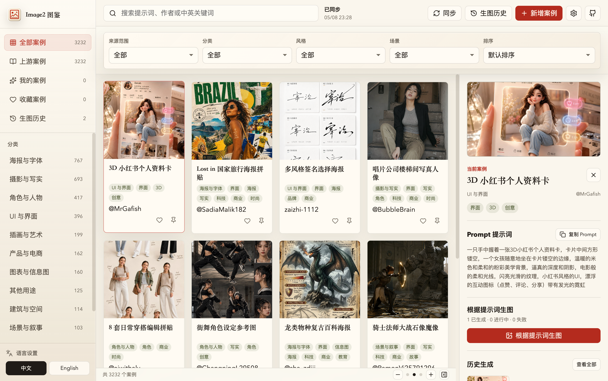
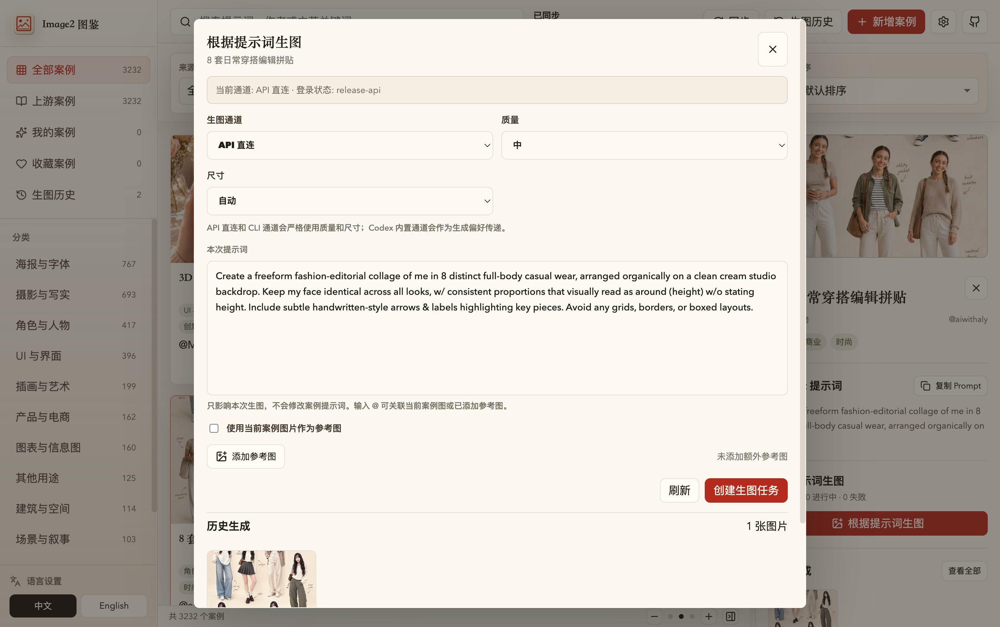
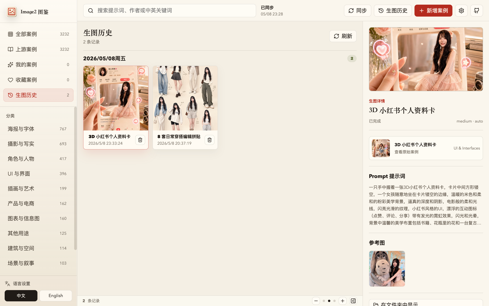
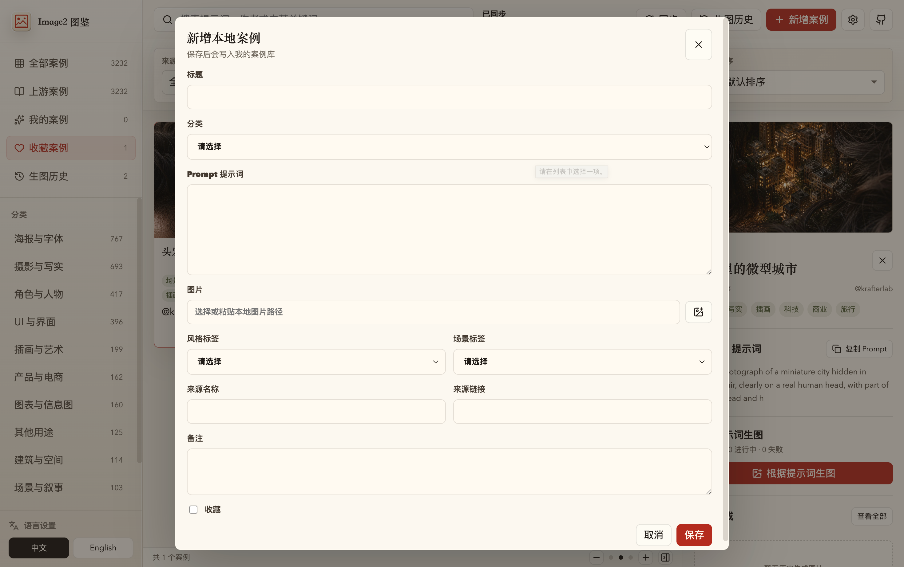
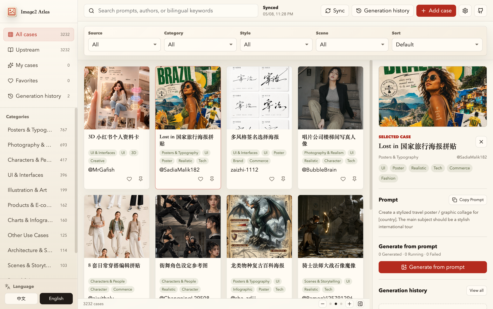
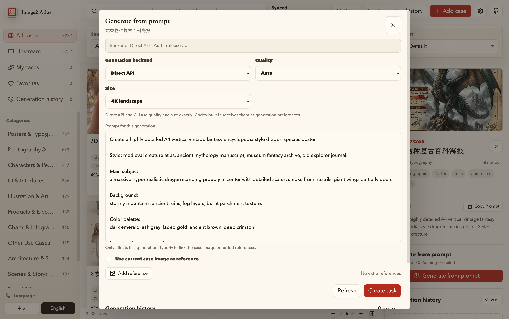
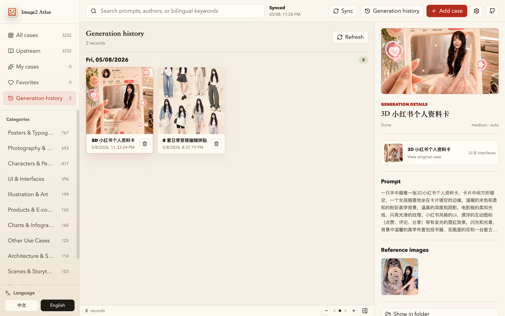
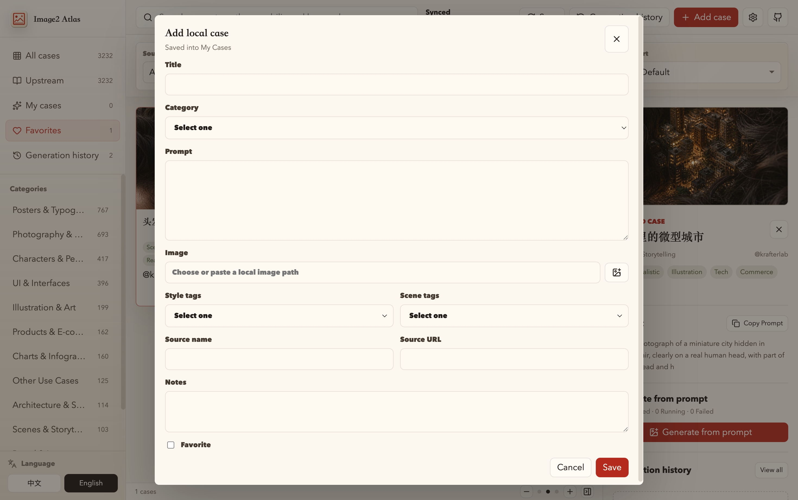

# Image2 Atlas

**中文** | [English](#english)

Image2 Atlas（Image2 图鉴）是一款面向 GPT Image 2 创作的 macOS 与 Windows 桌面应用，用于集中浏览、搜索、整理、收藏、同步和复用高质量图片案例与 Prompt。它把公开案例、来源信息、本地案例和生图历史整合到一个可长期维护的桌面图鉴里。

本仓库是 Image2 Atlas 的公开发布仓库，仅用于产品介绍、发布说明、授权声明和安装包下载。本仓库不公开分发源代码。

## 下载

最新安装包请前往 [Releases](../../releases) 页面下载。

当前发布包：

- macOS：`Image2.Atlas-0.1.0-arm64.dmg`
  - 适用于 Apple Silicon Mac
  - 已使用 Developer ID 签名
  - 已通过 Apple notarization 公证
  - 已 stapled 公证票据
- Windows：`Image2 Atlas Setup 0.1.0-x64.exe`
  - 适用于 Windows x64
  - NSIS 安装包
  - 未配置 Windows Authenticode 代码签名证书
  - 首次安装可能触发 Microsoft Defender SmartScreen 提示

安装包 SHA256 请以 release 页面附带的 `SHA256SUMS.txt` 为准。

## 适合谁使用

- 想系统浏览 GPT Image 2 优秀案例的创作者
- 需要快速检索 Prompt、风格、场景和图片方向的设计师
- 想把公开案例和个人案例放在同一个本地工具里管理的用户
- 需要记录生图任务、回看历史结果、沉淀可复用提示词的人
- 希望保留案例来源链接、作者信息和第三方声明的用户

## 核心功能

### 案例图鉴

Image2 Atlas 内置经过整理的 GPT Image 2 案例快照，支持从卡片网格快速浏览图片、标题、作者、分类、风格和场景标签。右侧详情区会展示当前案例的大图、来源、标签和 Prompt。



### 搜索与筛选

应用支持按提示词、标题、作者和中英文关键词搜索。你也可以按来源范围、分类、风格、场景和排序方式筛选案例，适合在大量案例中快速定位可参考的方向。

常见检索方式：

- 搜索中文关键词，例如“海报”“产品”“写实”“角色”
- 搜索英文关键词，例如 `poster`、`product`、`infographic`
- 按分类浏览，例如海报与字体、摄影与写实、角色与人物、UI 与界面
- 按来源范围区分上游案例、我的案例和收藏案例

### 案例详情与 Prompt 复用

选中案例后，详情区会展示完整 Prompt，并提供复制按钮。案例来源会尽量显示真实作者或上游仓库作者；有真实来源链接时跳转真实来源，没有真实来源时跳转仓库主页。

### 根据 Prompt 生图

发布版支持 API 直连方式生成图片。你可以基于当前案例 Prompt 发起生图任务，并按需要调整提示词、尺寸、质量和参考图。



### 生图历史

生图任务会进入本地历史。你可以回看已完成结果、查看失败原因、跟踪进行中任务，并在需要时重试。



### 我的案例库

除了内置和上游案例，你也可以新增自己的本地案例，保存标题、分类、风格、场景、Prompt 和参考图片，用来沉淀自己的创作资料。



### 上游同步

发布版内置最小同步能力，可同步指定公开上游来源并与内置快照合并。同步内容会和内置案例去重，用户的本地案例、收藏和生图历史保存在本机数据目录中。

## 基本用法

1. 从 [Releases](../../releases) 下载适合你系统的安装包。
2. macOS：打开 DMG，把 `Image2 Atlas.app` 拖入 Applications。
3. Windows：运行 `Image2 Atlas Setup 0.1.0-x64.exe` 并按安装向导完成安装。
4. 启动应用后，在左侧选择“全部案例”“上游案例”“我的案例”“收藏案例”或“生图历史”。
5. 使用顶部搜索框和筛选栏定位案例。
6. 选中案例后，在右侧详情区查看大图、来源和 Prompt。
7. 点击“复制 Prompt”复用提示词。
8. 配置 API 后，可以点击“根据提示词生图”创建生成任务。
9. 在“生图历史”中回看生成结果和任务状态。

## 安装与安全状态

macOS 版本安装包已完成：

- Developer ID 签名
- Hardened Runtime
- Apple notarization
- Stapled notarization ticket
- Gatekeeper 验证

Windows x64 安装包为未签名 NSIS 安装包。未购买 Windows 代码签名证书前，Windows 可能显示 Microsoft Defender SmartScreen 风险提示。请仅从本仓库 Releases 页面下载，并核对 SHA256。

Windows 卸载程序默认保留用户数据。卸载前会显示复选框组件页，用户可选择是否删除同步缓存、生图历史和 API 设置，或删除全部本机数据。

你可以在终端中自行校验下载文件：

```bash
shasum -a 256 "Image2.Atlas-0.1.0-arm64.dmg"
shasum -a 256 "Image2 Atlas Setup 0.1.0-x64.exe"
```

应与 release 页面中的 `SHA256SUMS.txt` 一致。

## 授权与权利声明

Image2 Atlas 应用本体、界面、打包产物和发布材料为专有软件。用户仅获得有限的安装和使用许可。

除非取得权利人事先书面授权，禁止：

- 商业使用
- 复制、再分发、转售或再授权
- 反向工程、反编译或反汇编
- 修改、破解或绕过授权校验
- 移除版权声明或授权标识
- 托管、镜像或重新打包分发本软件

完整条款见 [EULA.md](./EULA.md)。

## 第三方内容

Image2 Atlas 可能包含或展示来自第三方公开仓库的案例快照、图片、Prompt、链接和元数据。第三方内容仍受其原始许可证、权利声明或适用法律约束。Image2 Atlas 的专有授权不改变第三方内容原本的授权边界。

完整说明见 [THIRD_PARTY_NOTICES.md](./THIRD_PARTY_NOTICES.md)。

## 商业授权

任何商业使用均需取得权利人的事先书面授权，包括但不限于企业内部部署、为客户提供服务、集成到商业产品或服务、批量安装、代运营、素材生产服务、培训交付、SaaS 服务、API 服务或其他营利性使用。

---

## English

Image2 Atlas is a proprietary macOS and Windows desktop app for browsing, searching, organizing, syncing, and reusing GPT Image 2 prompt/image cases. It brings public cases, source metadata, local cases, favorites, and generation history into one maintainable desktop atlas.

This public repository is used only for product information, release notes, license notices, and installer downloads. Source code is not publicly distributed from this repository.

## Download

Download the latest installer from the [Releases](../../releases) page.

Current packages:

- macOS: `Image2.Atlas-0.1.0-arm64.dmg`
  - Apple Silicon Mac only
  - Signed with Developer ID
  - Notarized by Apple
  - Notarization ticket stapled
- Windows: `Image2 Atlas Setup 0.1.0-x64.exe`
  - Windows x64
  - NSIS installer
  - Not Authenticode-signed
  - Microsoft Defender SmartScreen may warn on first install

Use the `SHA256SUMS.txt` attached to the release to verify the installer.

## Who It Is For

- Creators who want to browse high-quality GPT Image 2 examples
- Designers who need fast prompt, style, scene, and visual references
- Users who want public cases and personal cases in one local app
- Users who want generation history, reusable prompts, and traceable sources
- Users who care about source links, author metadata, and third-party notices

## Features

### Case Atlas

Image2 Atlas includes a curated GPT Image 2 case snapshot. The gallery shows images, titles, authors, categories, styles, and scene tags. The detail panel shows the selected case image, source, tags, and prompt.



### Search And Filters

Search by prompt, title, author, and Chinese or English keywords. Filter by source scope, category, style, scene, and sort order.

### Prompt Details

Open a case to inspect its prompt and source. Source links prefer the original author/source when available; otherwise they fall back to the repository owner and repository homepage.

### Image Generation

The release build supports direct API image generation. You can start a generation task from the current case prompt and adjust prompt text, size, quality, and references.



### Generation History

Generation tasks are stored locally. You can review completed images, inspect failures, track running tasks, and retry when needed.



### Local Case Library

Create your own local cases with title, category, style, scene, prompt, and image reference.



### Upstream Sync

The release build includes minimal upstream sync support. Synced public cases are merged with the embedded snapshot and deduplicated. Local cases, favorites, settings, and generation history remain on your device.

## Basic Usage

1. Download the installer for your platform from [Releases](../../releases).
2. macOS: open the DMG and drag `Image2 Atlas.app` into Applications.
3. Windows: run `Image2 Atlas Setup 0.1.0-x64.exe` and follow the installer.
4. Launch the app and browse All Cases, Upstream Cases, My Cases, Favorites, or Generation History.
5. Use search and filters to find relevant cases.
6. Select a case to view its image, source, tags, and prompt.
7. Click Copy Prompt to reuse the prompt.
8. Configure your API settings and start generation from a prompt.
9. Review results in Generation History.

## Installation And Security

The macOS installer is:

- Developer ID signed
- Built with Hardened Runtime
- Notarized by Apple
- Stapled with a notarization ticket
- Verified with Gatekeeper

The Windows x64 installer is an unsigned NSIS installer. Because no Windows code signing certificate is configured, Microsoft Defender SmartScreen may show a warning. Download only from this repository's Releases page and verify the SHA256 checksum.

The Windows uninstaller preserves user data by default. Before uninstalling, it shows a checkbox page where users can choose whether to delete sync cache, generation history and API settings, or all local app data.

Verify the downloaded file:

```bash
shasum -a 256 "Image2.Atlas-0.1.0-arm64.dmg"
shasum -a 256 "Image2 Atlas Setup 0.1.0-x64.exe"
```

The result should match `SHA256SUMS.txt` on the release page.

## License And Rights Notice

The Image2 Atlas application, UI, packaged binary, and release materials are proprietary software. Users receive only a limited installation and usage license.

Without prior written permission from the rights holder, the following are prohibited:

- Commercial use
- Copying, redistribution, resale, or sublicensing
- Reverse engineering, decompilation, or disassembly
- Modification, cracking, or bypassing license checks
- Removing copyright or license notices
- Hosting, mirroring, or repackaging the software

See [EULA.md](./EULA.md) for the full terms.

## Third-Party Content

Image2 Atlas may include or display embedded snapshots, images, prompts, links, and metadata derived from third-party public repositories. Third-party content remains governed by its original license, rights statement, or applicable law. The proprietary Image2 Atlas license does not change the rights boundary of third-party content.

See [THIRD_PARTY_NOTICES.md](./THIRD_PARTY_NOTICES.md).

## Commercial Authorization

Commercial use requires prior written authorization from the rights holder, including enterprise deployment, customer-facing services, integration into commercial products or services, batch installation, managed operations, creative production services, training delivery, SaaS services, API services, or any other profit-oriented use.
